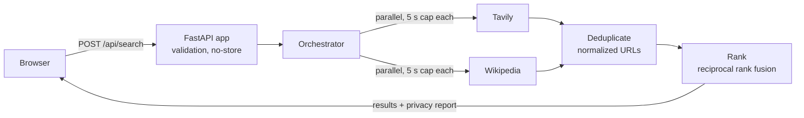

# Private Search

[](https://github.com/topukumar538/private-search/actions/workflows/ci.yml)

A metasearch engine that queries several search providers at once, merges their results, and never passes on who is searching. Providers see the question, coming from this server; they never see the user's IP address, cookies or browser details, and the server never writes search words to its logs.

**Live demo:** _link coming soon_ · **Status:** in active development (see [Roadmap](#roadmap))


## How it works



1. The browser sends the query in a POST body, so it never appears in the address bar, browser history or access logs.
2. The orchestrator asks every source **concurrently** through one shared HTTP client. Each source has a hard time limit; a slow or failing source is reported and skipped while the others' results are still returned.
3. Results are validated at the boundary: a malformed item (missing title, non-web URL) is dropped on its own instead of failing the whole source. Snippets are cleaned of leftover markup and shortened at a word boundary.
4. Duplicate pages are merged using normalized URLs (case, default ports, tracking parameters such as `utm_source`, percent-encoding).
5. Results are ranked with **reciprocal rank fusion**, so pages that several sources agree on rise to the top.

## Privacy: what it protects, and what it doesn't

| | |
|---|---|
| **Search providers see** | The search words, as typed, coming from this server's IP address |
| **Kept from providers** | The user's IP address, cookies and browser details |
| **Server logs record** | Which providers answered, how fast, and error types. Never search words or error messages (which can contain URLs) |
| **The page itself** | No cookies, accounts or tracking scripts; nothing is loaded from another website (system fonts, no favicon services) |
| **Not protected** | Opening a result connects the user's browser directly to that website. With few users, providers see one busy client rather than a large crowd. Users must trust the server operator not to log. |

A test suite enforces the logging rules. While building it I found that `httpx` logs every request URL at INFO level by default, which would have written users' search words into the logs; the app silences it, and a test (with a negative control proving the test can detect a leak) keeps it that way.

## Engineering highlights

- **Async fan-out with graceful degradation:** `asyncio.gather` over all sources with per-source timeouts; partial results instead of total failure.
- **Pluggable sources:** every provider implements one `SearchSource` interface, so adding a provider is one file plus tests.
- **Validation at the boundary:** a frozen Pydantic `SearchResult` model rejects unsafe or malformed data before it reaches ranking or the browser.
- **One shared HTTP client** created in FastAPI's lifespan, with connection limits and timeouts tuned below the orchestrator's cap.
- **100+ automated tests** using a fake network (`httpx.MockTransport`), so no test touches a real API.
- **CI on every push:** tests, Docker build, a check that secrets and tests are not in the image, and a container health smoke test.

## Performance

Load-tested with [Locust](https://locust.io) against the real app with **simulated providers** (random 0.2–1.5 s delays, 5% failure rate each), so the test measures this server rather than third-party APIs and uses no API quota. Each simulated user searches, reads for 1–3 s, and searches again. An automated capacity search steps up the load, then bisects to find the most users the server handles within the target.

**Target:** p95 response time ≤ 2 s and errors ≤ 1%. **Result: about 1,250 concurrent users.**

| Users | Searches/s | p50 (ms) | p95 (ms) | p99 (ms) | Errors | Result |
|---|---|---|---|---|---|---|
| 100 | 28 | 1100 | 1500 | 1600 | 0.11% | pass |
| 250 | 69 | 1100 | 1500 | 1500 | 0.18% | pass |
| 500 | 140 | 1100 | 1500 | 1500 | 0.26% | pass |
| 1000 | 277 | 1100 | 1500 | 1600 | 0.31% | pass |
| 1250 | 339 | 1100 | 1600 | 1700 | 0.23% | pass |
| 1500 | 356 | 1600 | 2200 | 2400 | 0.24% | fail |

- Up to 1,000 users, p95 equals the slowest simulated provider's delay: the server's own overhead is negligible.
- The server saturates at about 350 searches/s. Beyond that, requests queue and latency rises, but errors stay at the expected ~0.25% (both providers failing on the same search). It slows down instead of failing.
- Caveat: measured in WSL on one machine running both Locust and the server, so capacity on dedicated hardware is likely higher.

Reproduce it:

```bash
pip install locust
PYTHONPATH=. python loadtest/stub_server.py      # terminal 1
python loadtest/find_capacity.py                 # terminal 2
```

## Run it locally

```bash
python -m venv .venv
source .venv/bin/activate          # Windows: .venv\Scripts\activate
pip install -r requirements.txt
cp .env.example .env               # then add your Tavily API key
uvicorn app.main:app --reload
```

Open http://127.0.0.1:8000. Without a Tavily key the app still works, using Wikipedia only.

With Docker:

```bash
docker build -t private-search .
docker run --rm -p 7860:7860 --env-file .env private-search
```

Then open http://127.0.0.1:7860.

## Tests

```bash
pip install pytest
python -m pytest -v
```

## Project structure

```
app/
  main.py               API routes, lifespan (shared HTTP client)
  models.py             SearchResult model and validation
  sources/              base.py (interface), tavily.py, wikipedia.py
  services/             search.py (orchestrator), deduplication.py, ranking.py,
                        snippets.py, http_client.py, logging_config.py
  static/index.html     the frontend (no build step, no external assets)
tests/                  unit and API tests with a fake network
loadtest/               Locust users, stub server, automated capacity search
docs/                   README screenshot
```

## Roadmap

- [x] Concurrent multi-source search with partial-failure handling
- [x] URL normalization, deduplication and rank fusion
- [x] Privacy-safe logging, tests and CI, Docker image
- [x] Load test with automated capacity search
- [ ] Prove that no user-identifying headers reach providers (request-level tests)
- [ ] More sources: Brave Search, Stack Exchange, GitHub, arXiv
- [ ] Query planner that sends each query only to the sources likely to help, limiting how much of the query stream any one provider sees
- [ ] Cache with request coalescing, rate limiting, per-source budgets and circuit breakers
- [ ] Benchmark: result quality versus provider exposure